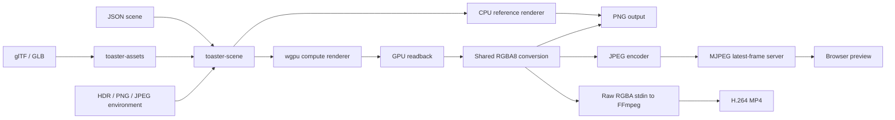

# Toaster

Toaster is a Rust-based headless GPU path tracer and procedural 3D scene sandbox. It begins with a small CPU reference renderer, then uses `wgpu` compute shaders so the same project can run on cluster GPUs and portable graphics backends.

The [documentation index](docs/README.md) links focused guides for the scene
format, renderer architecture, shaders, benchmarking, and cluster workflows.

## Ownership and project status

- **Chanyoung Park** owns the overall renderer architecture and integration across
  scene loading, GPU execution, animation, preview/export, and benchmarking.
- **Srujam Dave** contributed core WGSL path-tracing work, including geometry
  intersections, shading and direct lighting, antialiasing, and related fixes.

> Development note: We used AI tools during development.

## Goals

- Learn path tracing from a clear CPU implementation.
- Build a modular GPU renderer with measurable milestones.
- Support meshes, glTF, procedural environments, and eventually browser previews.
- Keep the repository approachable for new contributors and suitable for a future public mirror.

## Non-goals

Toaster is not a Blender replacement, game engine, or production DCC application. It deliberately avoids starting with CUDA, OptiX, or Vulkan ray-tracing extensions.

## Architecture



The MP4 path still reads rendered pixels back to the CPU. Its advantage is that
the shared RGBA frame is streamed straight to FFmpeg instead of being written as
an intermediate PNG sequence. See [Architecture](docs/architecture.md) for the
buffer, accumulation, and portability decisions behind this flow.

## Quickstart

Install a recent stable Rust toolchain, then run:

```sh
cargo check
cargo run -p toaster-cli -- info
cargo run -p toaster-cli -- cpu-render scenes/003_cornell_box.json --out out/cornell.png
```

The CPU renderer supports spheres, triangles, diffuse/metal/glass materials, and emissive area lights. Higher sample counts produce cleaner images but take longer in the current single-threaded reference renderer.

### GPU animation

```sh
# 24 frames sampled over one second
cargo run -p toaster-cli -- gpu-render scenes/006_rotating_cube.json \
  --out out/cube.png --fps 24 --duration 1

# Exactly 48 frames at an explicitly selected frame rate
cargo run -p toaster-cli -- gpu-render scenes/006_rotating_cube.json \
  --out out/cube.png --fps 30 --frames 48

# A two-second rotating cube with an independently orbiting Cornell-room camera
cargo run -p toaster-cli -- gpu-render scenes/004_mesh.json \
  --out out/cornell-cube.png --fps 24 --duration 2
```

Multi-frame output is numbered from `cube_0000.png`. Omitting all timing flags renders one frame at time zero; partial or conflicting timing options are rejected rather than defaulted.

### MP4 video export

To encode completed GPU frames directly into an H.264 MP4, install FFmpeg and
make sure `ffmpeg` is available on `PATH`:

```sh
ffmpeg -version

cargo run -p toaster-cli -- gpu-render scenes/006_rotating_cube.json \
  --video out/cube.mp4 --fps 24 --duration 4
```

`--frames` works in place of `--duration`. Video mode streams raw RGBA frames
to FFmpeg and does not create intermediate PNGs. It uses H.264 (`libx264`), CRF
18, and `yuv420p` for broad browser and player compatibility. `--video` accepts
an `.mp4` path and conflicts with the existing `--out` PNG option.

On a cluster, FFmpeg may need to be loaded through the module system first. If
the executable has a nonstandard name or location, set `TOASTER_FFMPEG` to its
path before running Toaster.

### Live GPU preview

Start a headless MJPEG preview server and render a scene for ten seconds:

```sh
cargo run -p toaster-cli -- stream-preview scenes/006_rotating_cube.json \
  --host 127.0.0.1 --port 7878 --fps 12 --duration 10
```

Open <http://127.0.0.1:7878/> in a browser. The server exposes:

- `/` — a minimal preview page
- `/stream` — the live `multipart/x-mixed-replace` JPEG stream
- `/status` — current frame timing and render settings as JSON
- `/healthz` — a basic health check

The host, port, and target frame rate default to `127.0.0.1`, `7878`, and `12` FPS. Omit `--duration` to keep rendering until Ctrl+C:

```sh
cargo run -p toaster-cli -- stream-preview scenes/006_rotating_cube.json
```

Preview frames are kept in memory and are not written to disk. If rendering is slower than the target FPS, each completed frame is published immediately and no backlog is created.

Preview quality can be adjusted without creating another scene file, and animation time can wrap while the render frame index keeps increasing:

```sh
cargo run -p toaster-cli -- stream-preview scenes/004_mesh.json \
  --fps 12 \
  --width 800 \
  --height 800 \
  --samples 16 \
  --max-bounces 6 \
  --loop-duration 2
```

The browser page displays the latest frame number, animation time, effective FPS, render time, resolution, samples, and bounce limit beneath the image.

Adaptive sampling can trade quality for cadence automatically. It starts from the scene or `--samples` value, stays within the selected bounds, and reports each adjustment through `/status`:

```sh
cargo run -p toaster-cli -- stream-preview scenes/004_mesh.json \
  --fps 12 --width 800 --height 800 --max-bounces 6 \
  --samples 16 --adaptive-samples --min-samples 2 --max-samples 32 \
  --loop-duration 2
```

Without `--adaptive-samples`, the preview keeps using the fixed scene or `--samples` value.

For a static scene, progressive mode accumulates small batches in linear color
until it reaches a target quality:

```sh
cargo run -p toaster-cli -- stream-preview scenes/010_environment_map.json \
  --progressive --batch-samples 2 --target-samples 256 \
  --fps 12
```

With only `--progressive`, batches default to 1 spp and the target defaults to
the scene's sample count. `--samples` and `--loop-duration` are intentionally
unavailable in this mode, and scenes containing animation tracks are rejected so
different poses are never averaged together. After reaching the target, Toaster
does no more GPU work but keeps the final image and `/status` available until
Ctrl+C or `--duration` expires.

Adaptive progressive preview adjusts the batch size while preserving the exact
target:

```sh
cargo run -p toaster-cli -- stream-preview scenes/010_environment_map.json \
  --progressive --batch-samples 2 --target-samples 256 \
  --adaptive-samples --min-samples 1 --max-samples 8 --fps 12
```

For a renderer running on a remote GPU machine, forward the loopback-bound server over SSH:

```sh
ssh -L 7878:127.0.0.1:7878 <remote>
```

Then run the preview command on the remote machine and open <http://127.0.0.1:7878/> locally.

### Render setting overrides

Scene render settings are used by default. Override any combination of resolution, samples, and path depth from the command line:

```sh
cargo run -p toaster-cli -- cpu-render scenes/003_cornell_box.json \
  --out out/cornell.png \
  --samples 512 \
  --width 800 \
  --height 800 \
  --max-bounces 12

# A faster preview that keeps the scene's max-bounces setting:
cargo run -p toaster-cli -- cpu-render scenes/003_cornell_box.json \
  --out out/cornell-preview.png --width 400 --height 400 --samples 32
```

### GPU benchmarks and logging

The pre-BVH scaling baseline below was measured on an **NVIDIA GeForce RTX 2080
Ti** through **Vulkan** with NVIDIA driver **610.43.02** on 2026-08-03. Every
scene used 320×180 output, 4 samples per pixel, 4 bounces, 2 warmup frames, and 5
measured frames at commit `d147e54`. FPS is `1000 / median total frame time`.

| Workload | Loaded geometry | Median dispatch/wait | Median total | FPS |
| --- | ---: | ---: | ---: | ---: |
| [128 triangles](docs/benchmarks/pre-bvh/rtx-2080-ti/001_triangles_128.json) | 128 triangles + 1 light sphere | 1.133 ms | 2.528 ms | 395.5 |
| [2,048 triangles](docs/benchmarks/pre-bvh/rtx-2080-ti/002_triangles_2048.json) | 2,048 triangles + 1 light sphere | 19.138 ms | 20.596 ms | 48.6 |
| [8,192 triangles](docs/benchmarks/pre-bvh/rtx-2080-ti/003_triangles_8192.json) | 8,192 triangles + 1 light sphere | 55.955 ms | 57.749 ms | 17.3 |
| [64 spheres](docs/benchmarks/pre-bvh/rtx-2080-ti/004_spheres_64.json) | 64 subject spheres + 1 light sphere + 2 triangles | 0.597 ms | 1.988 ms | 503.0 |
| [512 spheres](docs/benchmarks/pre-bvh/rtx-2080-ti/005_spheres_512.json) | 512 subject spheres + 1 light sphere + 2 triangles | 2.799 ms | 4.177 ms | 239.4 |
| [Mixed geometry](docs/benchmarks/pre-bvh/rtx-2080-ti/006_mixed_2048t_128s.json) | 2,048 triangles + 128 subject spheres + 1 light sphere | 23.171 ms | 24.649 ms | 40.6 |
| [Environment control](docs/benchmarks/pre-bvh/rtx-2080-ti/007_environment_control.json) | 4 spheres | 0.245 ms | 1.619 ms | 617.7 |

These are honest linear-traversal results, not projected BVH numbers. Reproduce
the suite with:

```sh
./scripts/run_benchmark_suite.sh pre-bvh
```

Use the benchmark command in release mode to establish a repeatable baseline.
It times GPU setup once, discards warmup frames, and summarizes steady-state
frames rendered at animation time zero with a fixed random seed:

```sh
cargo run --release -p toaster-cli -- benchmark scenes/004_mesh.json \
  --warmup 2 --runs 5 --out out/baseline.json \
  --image-out out/baseline.png
```

After an optimization, compare a candidate against the baseline. The optional
limit makes the command fail if median total frame time regresses by more than
the selected percentage on the same GPU:

```sh
cargo run --release -p toaster-cli -- benchmark scenes/004_mesh.json \
  --runs 5 --out out/candidate.json \
  --compare out/baseline.json --max-regression-percent 10
```

Operational logs go to stderr. They are readable text at `info` by default;
enable per-frame timings or JSON output globally with:

```sh
cargo run --release -p toaster-cli -- --log-level debug \
  benchmark scenes/004_mesh.json --out out/debug.json

RUST_LOG=toaster_gpu=debug cargo run --release -p toaster-cli -- \
  --log-format json stream-preview scenes/004_mesh.json
```

See [GPU benchmarking and logging](docs/benchmarking.md) for report fields,
comparison rules, and Slurm examples.

### glTF meshes

Scene files can load triangle geometry from `.gltf` and `.glb` assets. Mesh paths
are resolved relative to the scene file and glTF node transforms are applied
during loading. Set `material` to override every imported primitive with a named
Toaster material:

```json
{
  "type": "mesh",
  "path": "../assets/models/tetrahedron.gltf",
  "material": "porcelain",
  "group": "tetrahedron"
}
```

Omit `material` to use each primitive's glTF base-color factor and texture.
`NORMAL` and `TEXCOORD_0` attributes are interpolated at ray hits:

```json
{
  "type": "mesh",
  "path": "../assets/models/textured_quad.gltf",
  "group": "textured_quad"
}
```

Try the included textured animation in the live preview:

```sh
cargo run --release -p toaster-cli -- stream-preview \
  scenes/009_gltf_textured_quad.json --fps 12 --loop-duration 8
```

The current importer supports triangle primitives, node transforms, smooth
normals, UV set zero, and 8-bit base-color textures. Metallic-roughness shading,
normal maps, alpha modes, skinning, morph targets, and non-triangle primitives
remain deferred.

### Environment maps

Use an equirectangular HDR, PNG, or JPEG image as the background and as incoming
radiance when a path leaves the scene. Paths are resolved relative to the scene
file. `intensity` defaults to `1.0`, and `rotation_degrees` applies a yaw rotation:

```json
"background": {
  "type": "environment",
  "path": "../assets/environments/studio_test.hdr",
  "intensity": 8.0,
  "rotation_degrees": 20.0
}
```

Render the included small test environment on the CPU or GPU:

```sh
cargo run -p toaster-cli -- gpu-render scenes/010_environment_map.json \
  --out out/environment.png

cargo run -p toaster-cli -- stream-preview scenes/010_environment_map.json \
  --fps 12 --samples 8
```

HDR pixels remain linear floating-point radiance. PNG and JPEG environment maps
are converted from sRGB to linear color. To reduce diffuse-lighting noise,
Toaster builds a luminance-weighted distribution with the latitude sine term,
samples bright environment regions directly, and combines those samples with
cosine-weighted diffuse paths using multiple importance sampling (MIS). The CPU
and GPU renderers use the same distribution and PDF convention.

## Milestones

1. ✅ CPU sphere path tracer and material scattering
2. ✅ Emissive materials, initial triangles, and Cornell box
3. ✅ `wgpu` compute renderer and image readback
4. Triangle meshes and BVH acceleration (in progress)
5. ✅ Initial glTF geometry import and browser preview
6. ✅ HDR/PNG/JPEG environment-map lighting
7. ✅ Environment-map importance sampling and MIS
8. ✅ Static progressive GPU preview accumulation
9. ✅ Repeatable GPU benchmark reports and structured logging

See the [documentation index](docs/README.md), [roadmap](docs/roadmap.md), and
[architecture notes](docs/architecture.md) for focused context.
