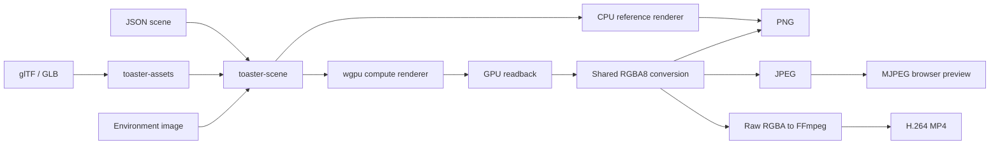

# Toaster

Toaster is a Rust-based headless path tracer and procedural 3D scene sandbox. It
keeps a readable CPU reference renderer alongside a portable `wgpu` compute
renderer for still images, animation, live browser previews, and MP4 export.

## Ownership

- **Chanyoung Park** owns the overall renderer architecture and integration
  across scene loading, GPU execution, animation, preview/export, and
  benchmarking.
- **Srujam Dave** contributed core WGSL path-tracing work, including geometry
  intersections, shading and direct lighting, antialiasing, and related fixes.

> Development note: We used AI tools during development.

## What it does

- Renders spheres and triangles with diffuse, metal, dielectric, and emissive
  materials on the CPU or GPU.
- Loads animated JSON scenes, glTF/GLB meshes, base-color textures, and
  HDR/PNG/JPEG environment maps.
- Supports direct-light sampling, environment importance sampling, and multiple
  importance sampling.
- Produces PNGs, H.264 MP4 files through FFmpeg, and an MJPEG browser preview
  with adaptive or progressive sampling.
- Captures repeatable, stage-level GPU benchmark reports for performance work.

Toaster is a learning and research project, not a Blender replacement, game
engine, or production rendering service.

## Architecture



The MP4 path reads pixels back to the CPU and streams raw RGBA frames to FFmpeg,
avoiding an intermediate PNG sequence. The
[architecture guide](docs/architecture.md) explains the buffer layouts,
progressive accumulation contract, and choice of `wgpu` over CUDA.

## Quickstart

Install a recent stable Rust toolchain:

```sh
cargo check --workspace
cargo run -p toaster-cli -- info

# CPU still
cargo run -p toaster-cli -- cpu-render scenes/003_cornell_box.json \
  --out out/cornell.png

# GPU still
cargo run --release -p toaster-cli -- gpu-render \
  scenes/010_environment_map.json --out out/environment.png
```

Common GPU workflows:

```sh
# Four-second H.264 video; requires FFmpeg on PATH
cargo run --release -p toaster-cli -- gpu-render \
  scenes/006_rotating_cube.json --video out/cube.mp4 \
  --fps 24 --duration 4

# Live browser preview at http://127.0.0.1:7878/
cargo run --release -p toaster-cli -- stream-preview \
  scenes/009_gltf_textured_quad.json --fps 12 --loop-duration 8

# Static progressive preview
cargo run --release -p toaster-cli -- stream-preview \
  scenes/010_environment_map.json --progressive \
  --batch-samples 2 --target-samples 256
```

## Performance

This pre-BVH baseline was measured on an **NVIDIA GeForce RTX 2080 Ti** through
**Vulkan** with NVIDIA driver **610.43.02** on 2026-08-03. All workloads use
320×180 output, 4 samples per pixel, 4 bounces, 2 warmup frames, and 5 measured
frames at commit `d147e54`. FPS is `1000 / median total frame time`.

| Workload | Loaded geometry | Dispatch/wait | Total | FPS |
| --- | ---: | ---: | ---: | ---: |
| [128 triangles](docs/benchmarks/pre-bvh/rtx-2080-ti/001_triangles_128.json) | 128 triangles + 1 light sphere | 1.133 ms | 2.528 ms | 395.5 |
| [2,048 triangles](docs/benchmarks/pre-bvh/rtx-2080-ti/002_triangles_2048.json) | 2,048 triangles + 1 light sphere | 19.138 ms | 20.596 ms | 48.6 |
| [8,192 triangles](docs/benchmarks/pre-bvh/rtx-2080-ti/003_triangles_8192.json) | 8,192 triangles + 1 light sphere | 55.955 ms | 57.749 ms | 17.3 |
| [64 spheres](docs/benchmarks/pre-bvh/rtx-2080-ti/004_spheres_64.json) | 64 spheres + 1 light sphere + 2 triangles | 0.597 ms | 1.988 ms | 503.0 |
| [512 spheres](docs/benchmarks/pre-bvh/rtx-2080-ti/005_spheres_512.json) | 512 spheres + 1 light sphere + 2 triangles | 2.799 ms | 4.177 ms | 239.4 |
| [Mixed geometry](docs/benchmarks/pre-bvh/rtx-2080-ti/006_mixed_2048t_128s.json) | 2,048 triangles + 128 spheres + 1 light sphere | 23.171 ms | 24.649 ms | 40.6 |
| [Environment control](docs/benchmarks/pre-bvh/rtx-2080-ti/007_environment_control.json) | 4 spheres | 0.245 ms | 1.619 ms | 617.7 |

These results show the current brute-force traversal cost; they are not projected
BVH numbers. Run the same suite with:

```sh
./scripts/run_benchmark_suite.sh pre-bvh
```

See the [benchmarking guide](docs/benchmarking.md) for report fields, comparisons,
and cluster usage.

## Current limitations

- Triangle and sphere intersections are linear scans until BVH integration lands.
- glTF support is limited to triangle geometry, base-color factors and textures,
  smooth normals, and UV set zero.
- GPU output requires CPU readback; the preview uses MJPEG and has no
  authentication or multi-render orchestration.
- The CPU reference renderer is single-threaded, and progressive accumulation is
  limited to static scenes.

## Documentation

- [Scene format](docs/scene_format.md)
- [Architecture decisions](docs/architecture.md)
- [Rendering notes](docs/rendering_notes.md)
- [Shader contracts](docs/shader_reference.md)
- [GPU benchmarking and logging](docs/benchmarking.md)
- [Cluster and streaming setup](docs/server_setup.md)
- [Roadmap](docs/roadmap.md)
- [Contributing](CONTRIBUTING.md)
