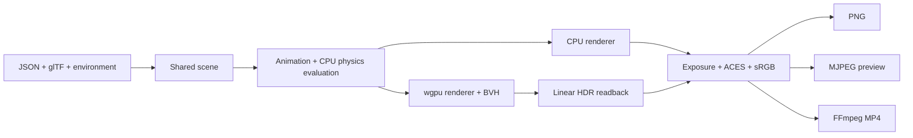

# Toaster

Toaster is a Rust headless path tracer with a readable CPU renderer and a
portable `wgpu` compute renderer. It supports animated and physically simulated
JSON scenes, glTF meshes, environment lighting, PNG/MP4 output, and live browser
previews.

## Ownership

- **Chanyoung Park:** renderer architecture and integration across scenes, GPU
  execution, animation, preview/export, and benchmarking.
- **Srujam Dave:** core WGSL path-tracing work, including intersections,
  shading, direct lighting, antialiasing, and related fixes.

> Development note: We used AI tools during development.

## Highlights

- Diffuse, metal, dielectric, emissive, textured, and environment-lit rendering.
- Power-weighted emissive geometry selection for lower-variance direct lighting.
- Median-split BVH construction with flat CPU and GPU traversal.
- Renderer-neutral rigid-body evaluation with CPU-side Rapier simulation for
  static, dynamic, and animation-driven kinematic spheres and boxes.
- Renderer-neutral collision start/stay/exit events and invisible box/sphere
  trigger zones with stable scene-authored identities.
- Declarative event-driven material flashes and named per-loop/session counters
  exposed by live preview status.
- Event-driven dynamic-body resets and named-spawn teleports with neutral
  clear/preserve velocity policy.
- Static progressive preview, adaptive sampling, MJPEG streaming, and raw-RGBA
  FFmpeg export without intermediate PNGs.
- Linear-HDR rendering with scene-authored exposure, ACES fitted tone mapping,
  and standard sRGB output shared by PNG, MP4, and MJPEG paths.
- Deterministic benchmark reports with per-stage timing and image hashes.

## Architecture



The [architecture guide](docs/architecture.md) records the buffer-layout,
progressive-accumulation, and portability decisions.

## Quickstart

```sh
cargo check --workspace

cargo run -p toaster-cli -- cpu-render \
  scenes/003_cornell_box.json --out out/cornell.png

cargo run --release -p toaster-cli -- gpu-render \
  scenes/010_environment_map.json --out out/environment.png \
  --exposure-stops 1.0

cargo run --release -p toaster-cli -- gpu-render \
  scenes/011_physics_rigid_bodies.json --video out/physics.mp4 \
  --fps 24 --duration 5

cargo run --release -p toaster-cli -- stream-preview \
  scenes/015_physics_reset_teleport.json \
  --host 127.0.0.1 --port 7878 --fps 12 --loop-duration 5

# glTF visual meshes driven by simple sphere/cuboid collider proxies
cargo run --release -p toaster-cli -- stream-preview \
  scenes/016_physics_gltf_proxies.json \
  --host 127.0.0.1 --port 7878 --fps 12 --loop-duration 5

cargo run --release -p toaster-cli -- \
  --log-level debug --log-format json \
  gpu-render scenes/013_physics_events_triggers.json \
  --out out/events.png --fps 24 --frames 120
```

See the [scene format](docs/scene_format.md) and
[cluster/preview setup](docs/server_setup.md) for additional workflows.

Toaster path traces and accumulates radiance in linear HDR. At output, it
applies exposure in stops, an ACES fitted filmic curve, and the standard sRGB
transfer function. `--exposure-stops <float>` overrides the scene exposure for
`cpu-render`, `gpu-render` (including MP4), and `stream-preview`.

## BVH performance

Measured on an NVIDIA GeForce RTX 2080 Ti through Vulkan with NVIDIA driver
610.43.02. Every workload used 320×180 output, 4 samples per pixel, 4 bounces, 2
warmups, and 5 measured frames. Lower time is better.

| Workload | Total geometry | Pre total | Post dispatch | Post total | Change | Post FPS |
| --- | ---: | ---: | ---: | ---: | ---: | ---: |
| [128 triangles](docs/benchmarks/post-bvh/rtx-2080-ti/001_triangles_128.json) | 128 T + 1 S | 2.528 ms | 0.597 ms | 1.856 ms | 26.6% faster | 538.8 |
| [2,048 triangles](docs/benchmarks/post-bvh/rtx-2080-ti/002_triangles_2048.json) | 2,048 T + 1 S | 20.596 ms | 0.968 ms | 2.906 ms | 85.9% faster | 344.1 |
| [8,192 triangles](docs/benchmarks/post-bvh/rtx-2080-ti/003_triangles_8192.json) | 8,192 T + 1 S | 57.749 ms | 1.457 ms | 6.183 ms | 89.3% faster | 161.7 |
| [64 subject spheres](docs/benchmarks/post-bvh/rtx-2080-ti/004_spheres_64.json) | 2 T + 65 S | 1.988 ms | 1.129 ms | 2.380 ms | 19.7% slower | 420.2 |
| [512 subject spheres](docs/benchmarks/post-bvh/rtx-2080-ti/005_spheres_512.json) | 2 T + 513 S | 4.177 ms | 1.752 ms | 3.142 ms | 24.8% faster | 318.3 |
| [Mixed geometry](docs/benchmarks/post-bvh/rtx-2080-ti/006_mixed_2048t_128s.json) | 2,048 T + 129 S | 24.649 ms | 2.478 ms | 4.558 ms | 81.5% faster | 219.4 |
| [Environment control](docs/benchmarks/post-bvh/rtx-2080-ti/007_environment_control.json) | 4 S | 1.619 ms | 0.671 ms | 1.887 ms | 16.6% slower | 529.8 |

All seven image hashes match the
[pre-BVH reports](docs/benchmarks/pre-bvh/rtx-2080-ti/). The results show large
gains as geometry grows and expected fixed-cost regressions on very small scenes.
For 8,192 triangles, dispatch became 38.4× faster; BVH rebuild/upload now accounts
for 3.50 ms of the 6.18 ms total, making caching or refitting the next clear
optimization.

Reproduce the comparison with:

```sh
TOASTER_BENCH_COMPARE_DIR=docs/benchmarks/pre-bvh/rtx-2080-ti \
  ./scripts/run_benchmark_suite.sh post-bvh
```

## Current limitations

- BVH construction uses median splits without SAH, refitting, or instancing.
- glTF shading supports base color but not the full metallic-roughness pipeline.
- GPU output requires CPU readback; the preview has no authentication or job
  orchestration.
- The CPU reference renderer is single-threaded, and progressive accumulation is
  limited to static scenes.
- Moving physics geometry currently rebuilds the mixed BVH each frame rather
  than refitting it.

## Documentation

- [Architecture decisions](docs/architecture.md)
- [Scene format](docs/scene_format.md)
- [Benchmarking](docs/benchmarking.md)
- [Cluster and preview setup](docs/server_setup.md)
- [Shader contracts](docs/shader_reference.md)
- [Contributing](CONTRIBUTING.md)
